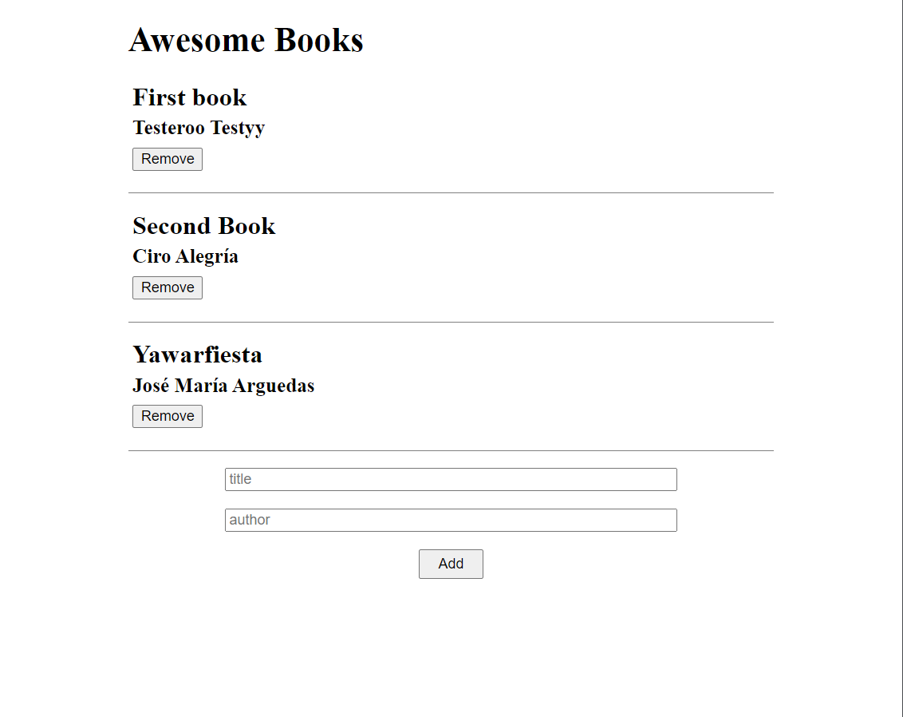

# Awesome books

"Awesome books" is a simple website that displays a list of books and allows you to add and remove books from that list.

## Features

- The website has one simple page that display a books list.
- Books can be added using the form.
- Books can be removed using the remove button related to each book.

## Built With

- HTML / CSS / Javascript

## Live Demo

[Awesome books](https://gabyse1.github.io/repo-capston-project-01/)

## Getting Started

To get a local copy up and running follow these simple example steps.

### Prerequisites

- Have a computer

### Install

- Install git on your local computer.
- Clone this repository to your local computer. Choose the location you prefer.

### Deployment

- Execute the index.html file to display the project.

## Authors

👤 **Gabriela Sánchez Espirilla**

- GitHub: [@gabyse1](https://github.com/gabyse1)
- Twitter: [@gabyse0](https://twitter.com/gabyse0)
- LinkedIn: [Gabriela](https://www.linkedin.com/in/gabriela-s%C3%A1nchez-espirilla-83011b225/)

👤 **Ramoun**

- GitHub: [@MrRamoun](https://github.com/MrRamoun)

## 🤝 Contributing

Contributions, issues, and feature requests are welcome!

Feel free to check the [issues page](../../issues/).

## Show your support

Give a ⭐️ if you like this project!

## Acknowledgments

- Linters: [Microverse](https://github.com/microverseinc/linters-config)
- Readme template: [Microverse](https://github.com/microverseinc/readme-template)

## 📝 License

This project is [MIT](./MIT.md) licensed.